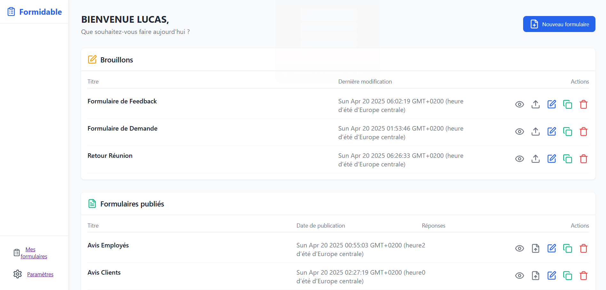
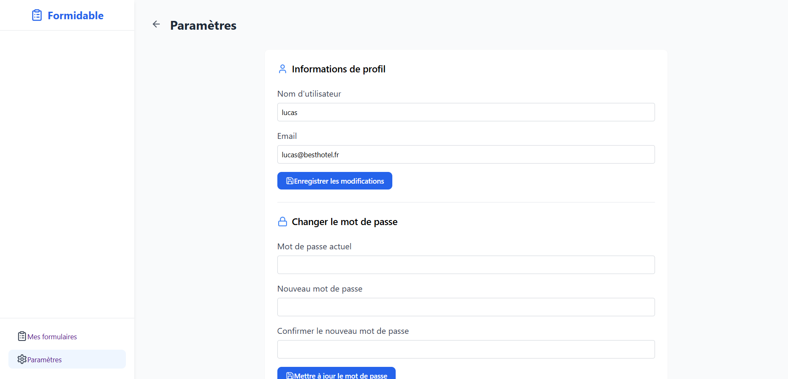
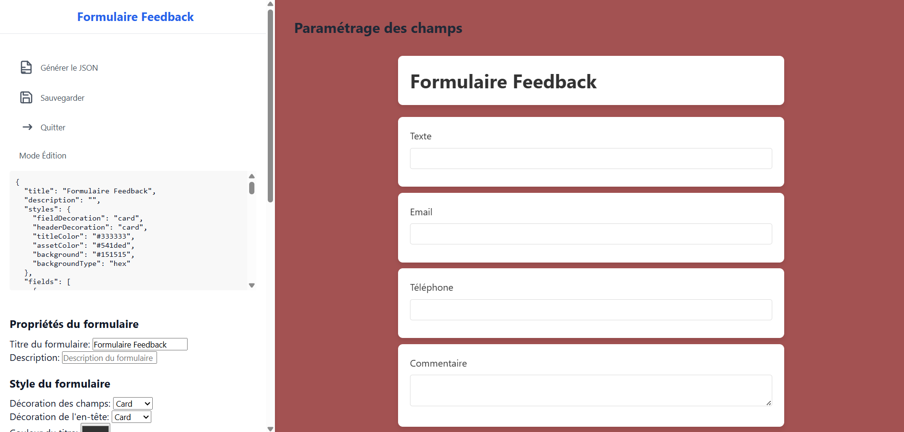
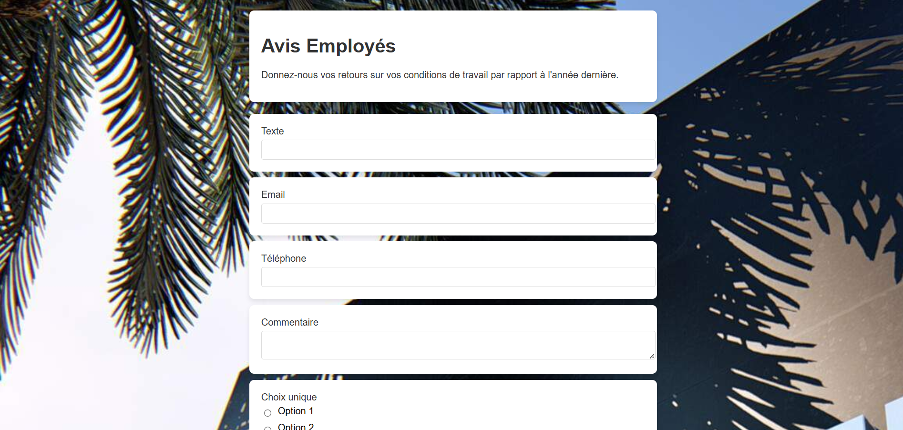

# 📝 Formidable

Formidable est une application web permettant de créer, gérer et répondre à des formulaires en ligne. Elle utilise Node.js, Express, Sequelize pour l'ORM, et Mustache pour le rendu des vues.

## 📜 Table des matières

- [📖 Description](#-description)
- [🖥️ Aperçu](#aperçu)
- [🚀 Fonctionnalités](#-fonctionnalités)
- [🛠️ Technologies utilisées](#technologies-utilisées)
- [📌 Prérequis](#-prérequis)
- [⚙️ Installation](#installation)

---

## 📖 Description


Formidable est une plateforme qui permet aux utilisateurs de créer, gérer et répondre à des formulaires en ligne. Elle offre plusieurs fonctionnalités avancées :

- **Création et gestion de formulaires** avec une interface intuitive.
- **Réponses aux formulaires** par les utilisateurs.
- **Prévisualisation des formulaires**
- **Gestion des champs simplifiés avec un UI**
- **Récupération des réponses en format CSV** pour une analyse facile.
- **Authentification des utilisateurs** pour sécuriser l'accès aux formulaires.

L'objectif est de fournir un outil simple et efficace pour la création et la gestion de formulaires en ligne. Que ce soit pour des enquêtes, des inscriptions ou des retours d'information, Forms Maker est là pour vous aider. 🚀

---

<h2 id="aperçu">🖥️ Aperçu</h2>

✨ **Interface utilisateur moderne et réactive**


📥 **Modification des données utilisateurs**


🛠️ **Éditeur de formulaires**


📋 **Gestion de formulaires**



---

## 🚀 Fonctionnalités

✔️ **Création de formulaires** avec des champs personnalisés.
📋 **Gestion des formulaires** créés par l'utilisateur.
📝 **Réponses aux formulaires** par les utilisateurs.
📥 **Export des réponses en CSV** pour une analyse facile.
🔒 **Authentification des utilisateurs** pour sécuriser l'accès.
⚡ **Interface moderne et réactive** pour une meilleure expérience utilisateur.

---

<h2 id="technologies-utilisées">🛠️ Technologies utilisées</h2>

- **💻 Framework** : Express.js
- **🗄️ ORM** : Sequelize
- **📄 Moteur de templates** : Mustache
- **🔒 Authentification** : Passport.js
- **🔑 Hachage des mots de passe** : Argon2
- **📦 Base de données** : MySQL

---

## 📌 Prérequis

Avant de commencer, assurez-vous d'avoir installé :

- **Node.js** : 23.9.0
- **NPM** : 11.1.0
- **MySQL** pour la base de données

---

<h2 id="installation">⚙️ Installation</h2>

1️⃣ **Clonez le dépôt**
```bash
git clone https://github.com/elias-ber/createur-formulaire.git
cd createur-formulaire
```

2️⃣ **Installez les dépendances**
```bash
npm install
```

3️⃣ **Configurez la base de données**
- Créez un fichier `.env` à la racine du projet e n vous basant sur `.example.env` et ajoutez vos variables d'environnement :
  ```env
  DB_USERNAME=votre_nom_utilisateur
  DB_PASSWORD=votre_mot_de_passe
  DB_NAME=formidable
  DB_HOST=localhost
  DB_CONNECTION=mysql
  SECRET_KEY=votre_cle_secrete
  ```

4️⃣ **Exécutez les migrations**
```bash
npx sequelize-cli db:migrate
```

Gestion des Models et Migrations avec un fichier `.sequelizerc`

5️⃣ **Démarrer l'application**
```bash
npm run start
```

6️⃣ **Accédez à l'application**
Ouvrez votre navigateur et allez sur :
```bash
http://localhost:3000
```

